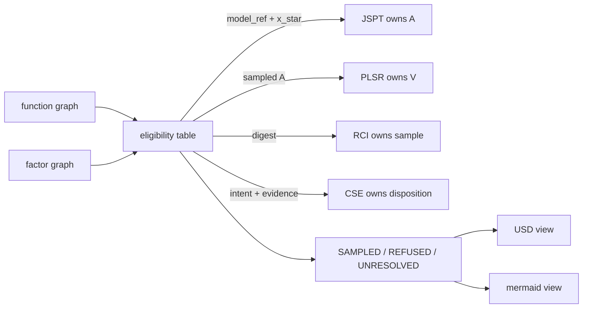

# Schematics Retrieval Agent

Function-graph plus factor-graph IR for setting up observers on declared
nonlinear plants. The agent retrieves typed subgraphs, applies an eligibility
table, and writes fail-closed annotations.

Short name **SRA**. The reusable library import is `schematics`.

OpenUSD is a projection. This package is not a twin platform and does not
import JSPT, PLSR, RCI, or CSE.

The central question is:

> Given an authored schematic, which subgraphs may call which kernel —
> and what remains UNRESOLVED?

## Map



Caption: retrieval is address, type, path, and blanket. Not embeddings.
A highlight is an opinion. A fixture A is not a JSPT sample.

## What is in the first slice

| Responsibility | What the agent demonstrates |
| --- | --- |
| IR | Port-level function nodes and factor nodes with typed edges. |
| Validation | Illegal edges refuse. No inferred `measures`. |
| Retrieval | `by_id`, `by_kind`, typed `path`, Markov `blanket`. |
| Eligibility | Table on declared `class`, `model_ref`, `x_star`, digest, written A. |
| Projections | `plant.sch.json` canonical; mermaid sheet; USDA view. |
| Fixture | Quadratic drag `xdot = u - c x |x|`, `y = x`. |

## Install and run

Python 3.12 or 3.13. [uv](https://docs.astral.sh/uv/) is the supported runner.

```bash
git clone https://github.com/giasonpooni/Schematics-Retrieval-Agent.git
cd Schematics-Retrieval-Agent
uv run --python 3.13 python examples/quickstart.py
uv run --python 3.13 python examples/unknown_plant.py
uv run --python 3.13 --with pytest pytest -q
```

Without uv:

```bash
python3 -m venv .venv
source .venv/bin/activate
pip install -e . pytest
PYTHONPATH=src python examples/quickstart.py
PYTHONPATH=src pytest -q
```

The quickstart writes `results/quickstart.md`, `results/quadratic_drag.sch.json`,
`results/quadratic_drag.mmd`, and `results/quadratic_drag.usda`.

CLI:

```bash
uv run --python 3.13 sra --fixture-A -o results
```

## Role next to JSPT, PLSR, RCI, CSE

This package owns the schematic and the router. Domain kernels stay in their
repos. Pin a git SHA of *this* repo from a consumer if needed. Do not put
`sensitivity` in this tree.

See [docs/KERNEL.md](docs/KERNEL.md), [docs/SCOPE.md](docs/SCOPE.md),
and [docs/MAP.md](docs/MAP.md).

## License

MIT. See [LICENSE](LICENSE).
