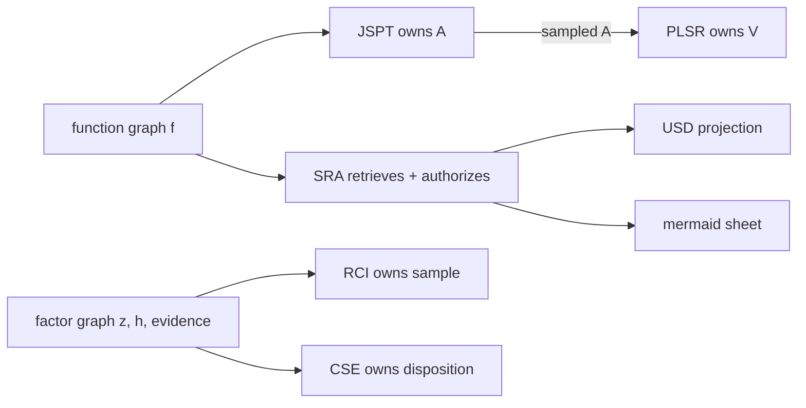

# Seating

```mermaid
flowchart LR
  FG["function graph f"] --> JSPT["JSPT owns A"]
  FG --> SRA["SRA retrieves + authorizes"]
  Fac["factor graph z, h, evidence"] --> RCI["RCI owns sample"]
  Fac --> CSE["CSE owns disposition"]
  JSPT -->|"sampled A"| PLSR["PLSR owns V"]
  SRA --> USD["USD projection"]
  SRA --> MMD["mermaid sheet"]
```

Function composition is not a potential. A measurement factor is not `f`.
USD is not the schematic.
